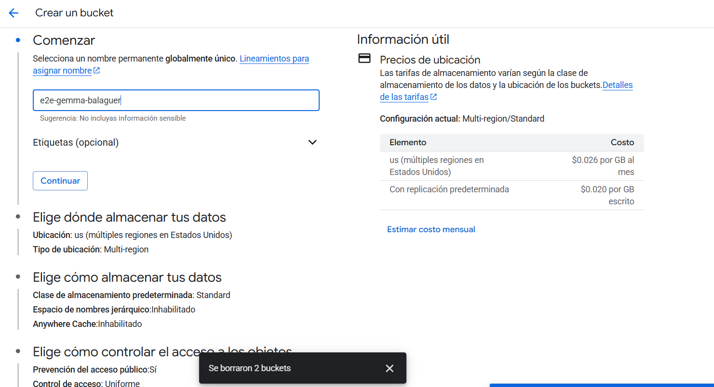
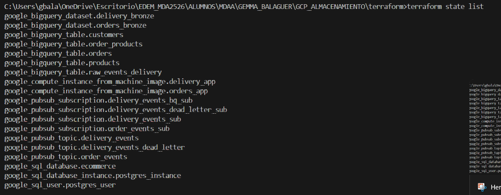
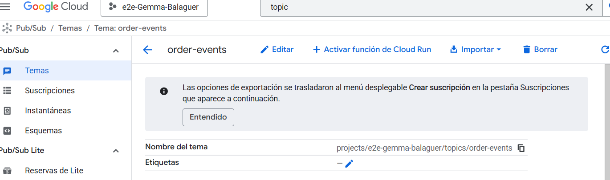
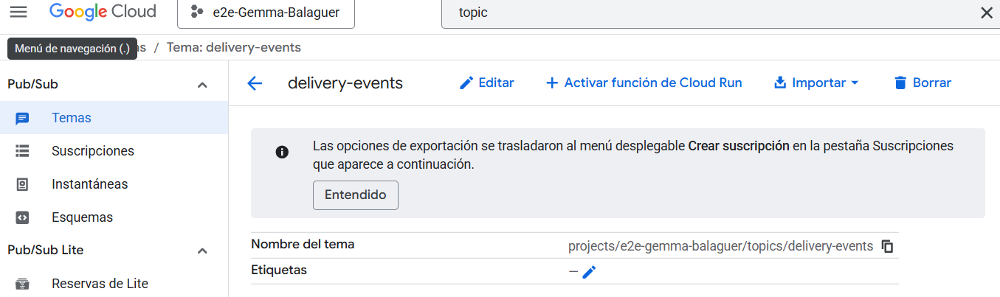
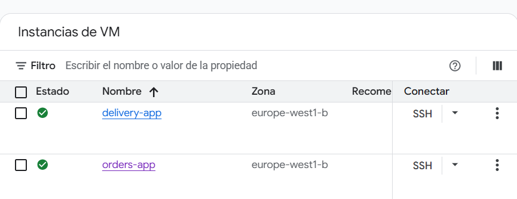
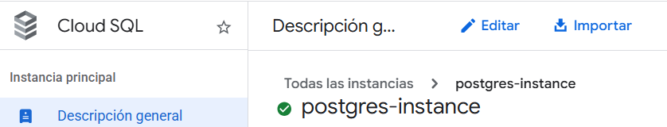
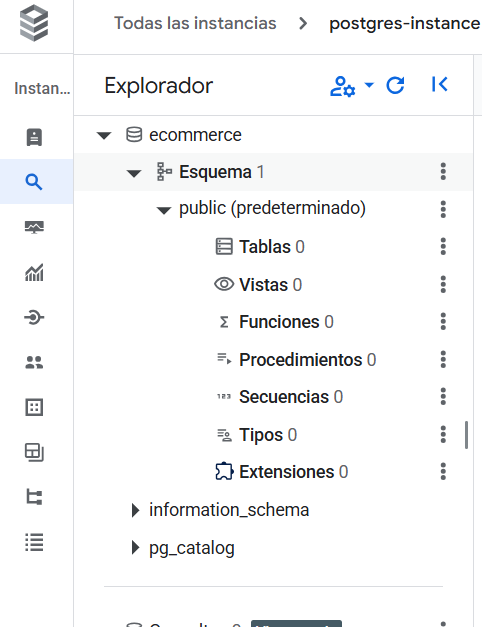
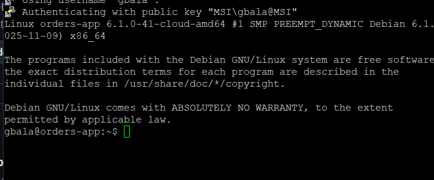
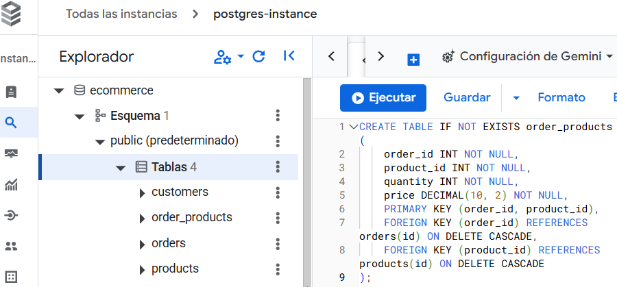
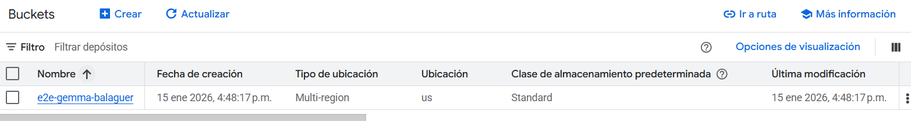

0. Creamos el bucket desde gcp


1. Ejecutamos con terraform (terraform init yterraform aply): 



2. Tópicos order-events y delivery-events en gcp.



1. Instancias orders-app y delivery-app en gcp.
 

1. Instancia de Postgresen gcp. 


1. Base de datos ecommerce en gcp. 


1. Ejecutamos los siguientes comandos en las dos instancias: 

**Log in to the instance:**
   ```sh
   gcloud compute ssh <instance-name> --zone=europe-west1-b
   ```


**Clone or pull latest changes from this repository**

Yo he copiado el repo de Francis en mi propio repo y por eso clono el mío.

```sh
git clone https://github.com/gemmabalagueer/GCP_ALMACENAMIENTO.git
``` 
Pero antes de ejecutarlo debemos descargar el paquete necesario (en este caso, no es necesaria la confirmación):

```sh
sudo apt-get update
sudo apt-get install git -y
```


**Move to the correct directory:**
   ```sh
   cd gcp-storage/gcp_datawarehouse/exercise_end2end
   ```


**Create a virtual environment:**
   ```sh
   python3 -m venv .venv
   ```
Para ejecutar el anterior comando, primero debemos instalar el paquete necesario (python3-venv). Por eso antes debemos ejecutar:
```sh
sudo apt-get update
sudo apt-get install python3-venv -y
```


**Activate the venv:**
   ```sh
   source .venv/bin/activate
   ```


**Install the requirements:**
   ```sh
   pip install -r requirements.txt
   ```


1. Creamos las tablas dentro de la base de datos de ecommerce (creadas desde Cloud SQL Studio )**


1. For the `orders-app` instance
Para ejecutar tu aplicación orders-app en segundo plano usando nohup (de modo que siga corriendo aunque cierres la terminal):
   
   ```sh
   nohup bash -c 'HOST_IP=35.205.184.23 GCS_BUCKET_NAME=e2e-gemma-balaguer PROJECT_ID=e2e_gemma_balaguer python -m orders-app.orders_to_db.main' > output.log 2>&1 &
   ```


This will start creating orders, store them in the database and publish confirmation events to the `order-events` topic.

If you want to see the logs, run the following command:
```sh
tail -f output.log
```


### For the `delivery-app` instance

1. Run the following command to start the `delivery-app`:
   ```sh
   nohup bash -c 'PROJECT_ID=<your-project-id> python -m delivery_app.main' > output.log 2>&1 &
   ```

If you want to see the logs, run the following command:
```sh
tail -f output.log
```

This will start consuming the events from the `order-events` topic and publish delivery events to the `delivery-events` topic.




